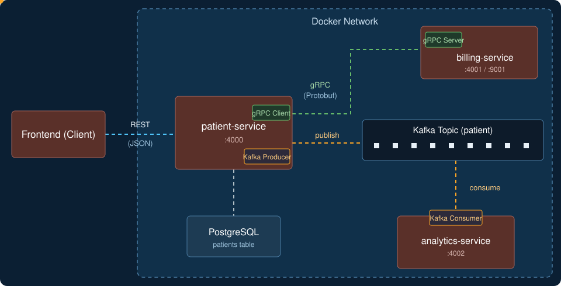

# Patient Management System

A Spring Boot microservices project where a patient REST API works together with a gRPC billing service and a Kafka analytics consumer.

## Architecture

  

## Description

When a client creates a patient through the REST API, `patient-service`:

1. Validates the input
2. Checks for a duplicate email
3. Saves the patient to PostgreSQL
4. Calls `billing-service` over **gRPC** to create a billing account
5. Publishes a `PATIENT_CREATED` event to **Kafka**

`analytics-service` listens to the Kafka topic, deserializes the Protobuf `PatientEvent`, and logs the patient info.

### Services

| Service | Port | Role |
|---|---|---|
| `patient-service` | 4000 | REST API (`GET/POST/PUT/DELETE /patients`), gRPC client, Kafka producer |
| `billing-service` | 4001 / 9001 | gRPC server (currently a mock that returns `accountId="12345"`, `status="ACTIVE"`) |
| `analytics-service` | 4002 | Kafka consumer (logs events, ready to be extended) |

### Tech Stack

Java, Spring Boot, PostgreSQL, gRPC, Protobuf, Kafka, Docker
